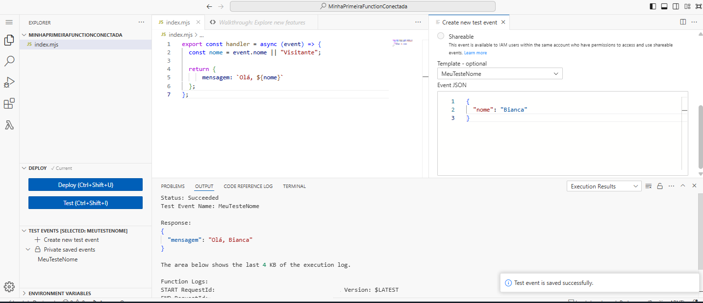
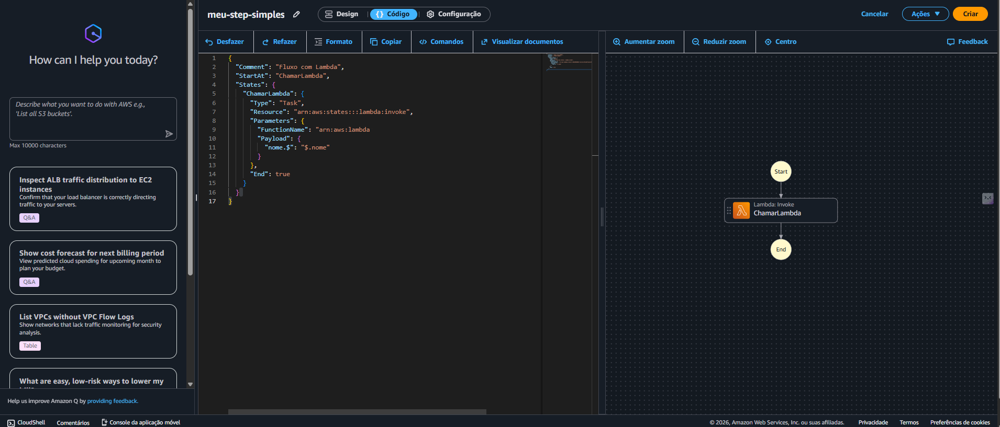
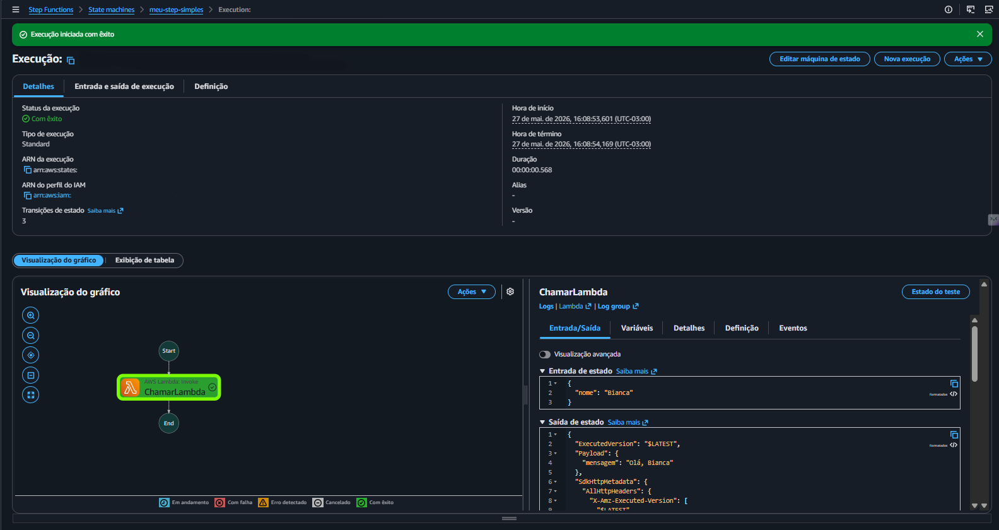

# 🚀 AWS Step Functions + Lambda (Exemplo Simples)

## 📌 Descrição
Este projeto tem como objetivo demonstrar, de forma prática, a integração entre o AWS Step Functions e o AWS Lambda, utilizando um fluxo simples de execução.

A proposta foi criar uma função que recebe um nome como entrada e retorna uma saudação personalizada.

---

## 🧠 O que foi feito

Para a function que eu criei, primeiro passo eu fiz o lambda dela  



No código, eu utilizei uma variável chamada `nome`. Como teste, configurei a entrada para enviar um nome e retornar uma mensagem personalizada.

Depois, eu criei o Step Function utilizando o ARN da função Lambda  



Após configurar o fluxo, defini um valor de entrada com o campo `nome`. Como resultado, a execução retornou corretamente a mensagem:

**"Olá, Bianca"**  



---

## ⚙️ Estrutura do Projeto

- AWS Lambda → responsável por processar o nome e retornar a mensagem  
- AWS Step Functions → responsável por orquestrar a execução da Lambda  

---

```json
{
  "nome": "Bianca"
}
```
 
---
 
<div align="center">
---
 
✨ **Feito por Bianca Muniz**
 
🔒 *Todas as credenciais foram ocultadas por segurança*
 
[](https://www.linkedin.com/in/bianca-muniz-7a664b209/)

*"Aprendendo na prática, um serviço AWS de cada vez." ☁️*
 
</div>